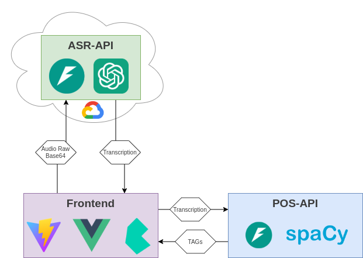

PLN-SCC5908
===

# Esquemático da Aplicação

> Use [Poetry](https://python-poetry.org/) to dependency management in Python.

> Both `asr-api`and `pos-api` are with [uvicorn](https://www.uvicorn.org/) and [starlette](https://www.starlette.io/) installed.

## asr-api

ASR Sugestion: [Faster-Whisper](https://github.com/SYSTRAN/faster-whisper).

## pos-api

[spacy](https://spacy.io/) already installed.